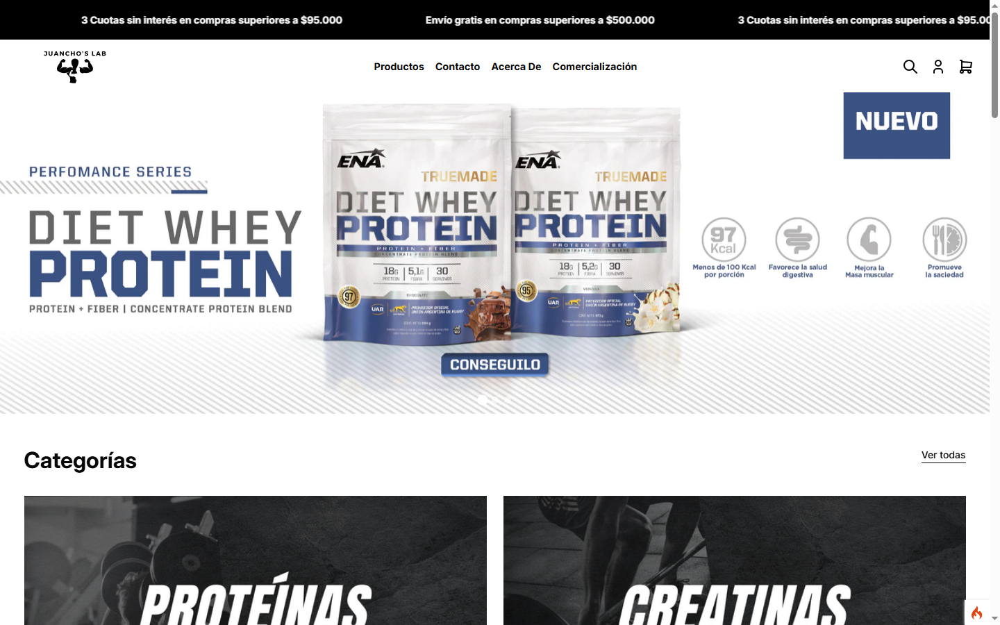
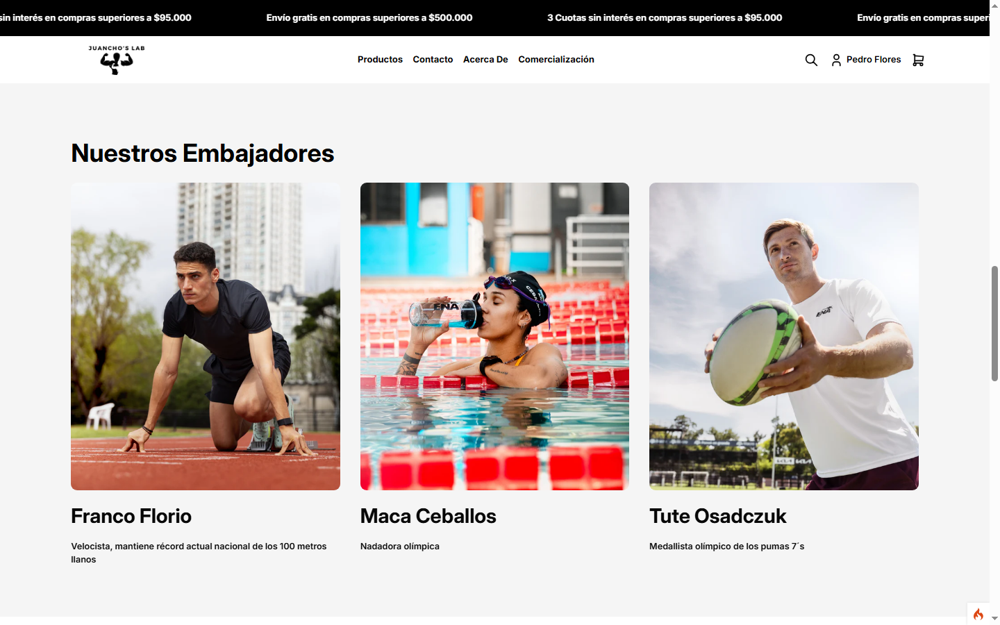
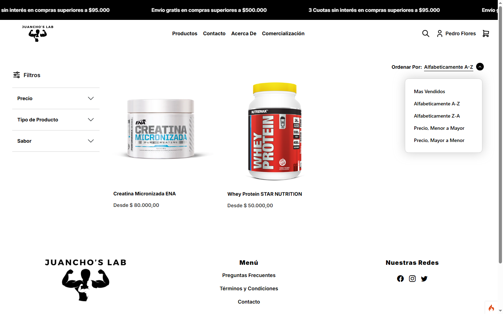
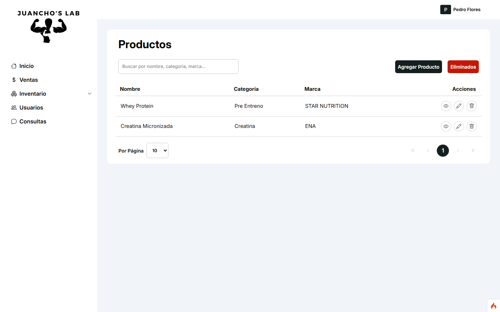
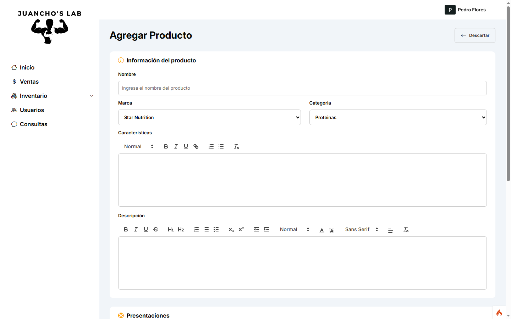
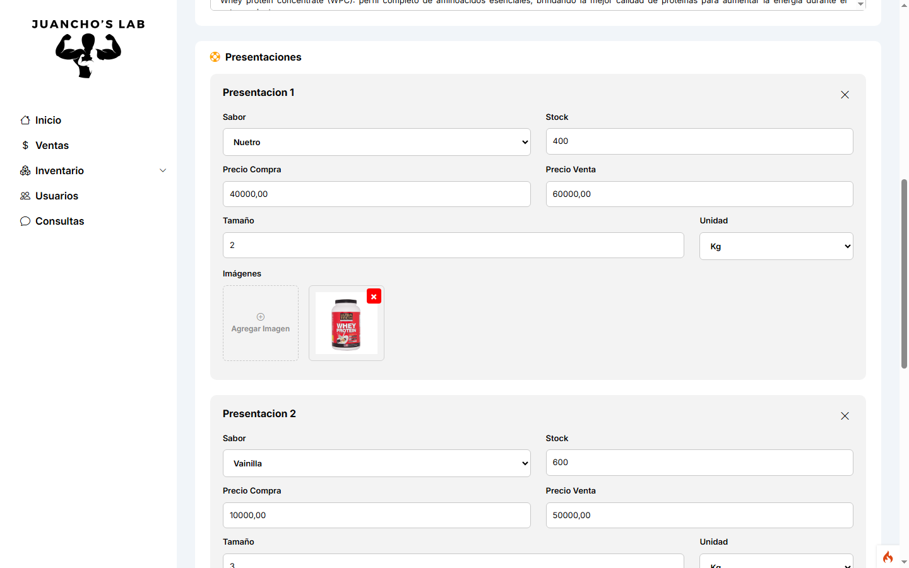
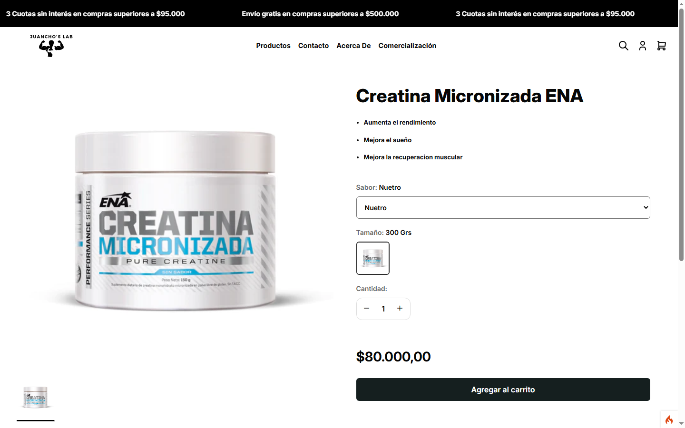
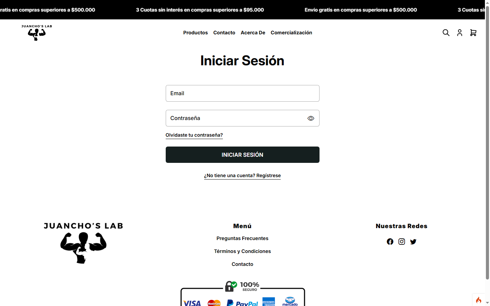

# 💪 Juanchos Lab - E-commerce de Suplementos Deportivos

**Juanchos Lab** es una plataforma de comercio electrónico enfocada en la venta de suplementos deportivos. Desarrollado como proyecto personal, busca ofrecer una experiencia funcional y ordenada para la gestión y compra de productos relacionados con el fitness y el bienestar.

## 🛠️ Tecnologías utilizadas

- **CodeIgniter 4** – Framework backend en PHP con patrón MVC
- **MySQL** – Base de datos relacional
- **Bootstrap 5** – Estilos y componentes responsive
- **JavaScript puro** – Interactividad en el frontend
- **HTML5 y CSS3**

## 🚀 Funcionalidades principales

- 🏠 **Home** con productos destacados y acceso rápido al catálogo  
- 📦 **Catálogo de productos** con filtros por marca, sabor, categoría, y precio 
- 🧃 **CRUD de productos** con distintas variantes (tamaños, sabores)  
- 🏷️ **Gestión de marcas, sabores y categorías**  
- 🔐 **Sistema de autenticación** (login y registro de usuarios)  
- 🛒 **Carrito de compras** con persistencia en sesión  
- 🧑‍💼 **Panel de administración** para gestionar el contenido  
- 📄 **Vistas dinámicas** con controladores y rutas limpias  

## 📸 Capturas de pantalla

## Home

## Catálogo

## Productos

## Detalle Producto

## Login

